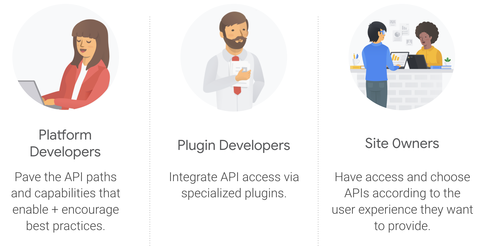

In our previous [post](http://web.dev/success-on-the-web-in-context/) we discussed the correlation between building user-first sites, and our ability to attain sustainable success as content creators and publishers. User-first sites are sites that have the following qualities:

  <table>
    <tbody>
      <tr>
        <td><b>Performance and Reliability</b></td>
        <td>Sites that load quickly consistently and offer good runtime performance</td>
      </tr>
      <tr>
        <td><b>Security</b></td>
        <td>Sites where they feel safe sharing their data and doing transactions on them</td>
      </tr>
      <tr>
        <td><b>Feature Richness and Integration</b></td>
        <td>Sites that are accessible, enagaging, and take advantage of the full capabilities of user devices</td>
      </tr>
      <tr>
        <td><b>High-quality content</b></td>
        <td>Sites that offer content witha good value proposition to users</td>
      </tr>
    </tbody>
  </table>

A key aspect of such user-first sites is the role of feature-rich and engaging experiences in enhancing our conversion funnels. In this post we discuss briefly how to approach the development of feature-rich and integrated websites and web applications.

## Global Audience

The Open Web is the only platform that offers universal reach, as it is accessible on virtually any device our users may have. Over half of the world is now online. This means that: (1) the web gives us access to the largest possible market, and (2) there is great room for growth, as still about half the population yet to get online.


Web Superpower: low-friction access to the largest possible market.


As the saying goes: with great power comes great responsibility. How can we develop feature-rich and integrated web applications targeting such a large audience? Let's see.

## The Capable Web

The good news are that the web platform has been evolving steadily and rapidly, thanks to the efforts of many people and organizations in the open web ecosystem. To get a sense of the amazing progress in the evolution of the web, we can mention four ongoing workstreams:

  <table>
    <tbody>
      <tr>
        <td><b>Web assembly</b></td>
        <td>
          A binary instruction format which provides a way to run code written in multiple languages on the web at near native speed
          (<a href="https://developer.mozilla.org/en-US/docs/WebAssembly">Learn more</a>).
        </td>
      </tr>
      <tr>
        <td><b>Web GPU</b></td>
        <td>the The W3C “GPU for the Web” Community Group is designing an API to expose the modern GPU APIs that are available on most current devices. This API is called <a href="https://gpuweb.github.io/gpuweb/">WebGPU</a></td>
      </tr>
      <tr>
        <td><b>Fugu</b></td>
        <td>Fugu is a cross-org program with the goal of reducing the app-web capabilities gap by streamlining web access to powerful, cross-platform, standardized capabilities on both mobile and desktop. <a href="https://web.dev/fugu-status/">Learn more</a>.</td>
      </tr>
      <tr>
        <td><b>PWA</b></td>
        <td>Umbrealla term capturing workstreams aimed at enabling the development of web apps that have an 'Appy' feeling; that is, web apps, that are fast and reliable, fully integrated with user devices, and engaging. <a href="https://developers.google.com/web/progressive-web-apps">Learn more</a>.</td>
      </tr>
    </tbody>
  </table>


Please follow the links above to learn more about each of the workstreams and how together they describe the reality of the web just being another platform on which we can successfully develop and deploy our online business presence.


Two of these work areas are of interest when we seek to answer the question: how do we develop web sites that are feature rich and integrated when out target audience has global reach?: Fugu and PWA.

## Developing for the Web Platform

The web platform today support pretty much everything provided by native app platforms. We can develop user experiences natively on the web that are feature-rich, engaging, and integrated with the devices from our users, while at the same time maintaining the core web tenets of openness, security, privacy, trust, and universal reach.


Today, the web platform supports (pretty much) everything provided by native app platforms.


Developing these experiences encompasses two areas:

  <table>
    <tbody>
      <tr>
        <td><b>Web platform capabilities</b></td>
        <td>
          This area is encompassed by the Fugu and PWA workstreams.
        </td>
      </tr>
      <tr>
        <td><b>User-first Mindset</b></td>
        <td>TBD</td>
      </tr>
    </tbody>
  </table>

## Fugu

We can think of Fugu in terms of the capabilities made available natively on the web platform. The [MDN web docs has a section](https://developer.mozilla.org/en-US/docs/Web/API) listing all the Web APIs, and linking to information about each one, and indicating which ones are available, wich ones are in development, and which ones have been deprecated. To get a bit of a sense of the kinds of APIs avaiable or in development, consider the following:

  <table>
    <tbody>
      <tr>
        <td><b>Web Bluetooth API</b></td>
        <td>
            Bluetooth Low Energy, or just BLE, is a wireless technology that you can find in many gadgets like heart rate sensors, beacons, lights, and also toys. BLE enbales a wide variety of <a href="https://developex.com/blog/interesting-applications-of-ble/">useful scenarios</a>, such as: connectivity to medical devices, reaction on proximity, Smart homes, Smart cities, and many more. With the Web Bluetooth API, we can devise and implement use cases like these natively on the web. <a href="https://developer.mozilla.org/en-US/docs/Web/API/Web_Bluetooth_API">[Learn more]</a>.</td>
      </tr>
      <tr>
        <td><b>File System API</b></td>
        <td>Enables to directly edit a file or multiple files without the need of performing the upload/download dance. <a href="https://developer.mozilla.org/en-US/docs/Web/API/FileSystem">[Learn more]</a>.</td>
      </tr>
      <tr>
        <td><b>Shape Detection API</b></td>
        <td>API with 3 interfaces: face detector (no face recognition), barcode detector (all kinds of barcodes), and text detector. <a href="https://web.dev/shape-detection/">[Learn more]</a>.</td>
      </tr>
      <tr>
        <td><b>Web Share and Share Target APIs</b></td>
        <td>The former integrates with the sharing mechanism on the user's device (<a href="https://developer.mozilla.org/en-US/docs/Web/API/Navigator/share">[Learn more]</a>). While the latter makes our saites available as a sgare target on the user device (<a href="https://web.dev/web-share-target/">[Learn more]</a>).</td>
      </tr>
      <tr>
        <td><b>Background Sync and Fetch</b></td>
        <td> Background Sync is useful to schedule any (not too big) data sending beyond the life of a page or when there is loss and recovery of connectivity. <a href="https://developers.google.com/web/updates/2015/12/background-sync">[Learn more]</a>. and Background Fetch provides a similar capability for larger resources (e.g. videos) <a href="https://developers.google.com/web/updates/2018/12/background-fetch">[Learn more]</a>.</td>
        </td>
      </tr>
    </tbody>
  </table>

## Fugu and WordPress

In a CMS platform, such as WordPress, the Fugu APIs can be leveraged either directly by developers of the platform (WordPress core) or developers of extensions for the platform (plugins, themes), or in general by users of the platform via plugins.

<figure class="w-figure">
  
  <figcaption class="w-figcaption">
    Access to Web APIs in the WordPress platform.
  </figcaption>
</figure>

## PWA

We can look at the notion of PWA as a 2-part whole. First, we have the PWA Foundations, that is, the building blocks on top of which websites with an "appy feeling" can be developed:

  <table>
    <tbody>
      <tr>
        <td><b>HTTPS</b></td>
        <td><a href="">[Learn more]</a>.</td>
      </tr>
      <tr>
        <td><b>Web App Manifest</b></td>
        <td><a href="">[Learn more]</a>.</td>
      </tr>
      <tr>
        <td><b>Service Workers</b></td>
        <td><a href="">[Learn more]</a>.</td>
      </tr>
    </tbody>
  </table>

And then we have the PWA capabilities, that is, the features and added value we implement in our sites leveraging the capabilities of the PWA bulding blocks, including:

  <table>
    <tbody>
      <tr>
        <td><b>Offline access</b></td>
        <td><a href="">[Learn more]</a>.</td>
      </tr>
      <tr>
        <td><b>Push notifications</b></td>
        <td><a href="">[Learn more]</a>.</td>
      </tr>
      <tr>
        <td><b>Add-to-home-Screen (A2HS)</b></td>
        <td><a href="">[Learn more]</a>.</td>
      </tr>
    </tbody>
  </table>

## PWA and WordPress

Bringing the notion of PWA into WordPress entails two aspects:

1. The integration of some modern web APIs and capabilities into the WordPress core platform, enabling a unified access to those capabilities.
1. Access to other modern web APIs, which have not beeing integrated into core, enabling WordPress developers to easily access those APIs and capabilities as they develop core functionality, as well as themes or plugins.

There is a feature plugin developed by Google and WordPress ecosystem cotributors, to enhance WordPress capabilities regarding HTTPS, enabling the creation of Web App Manifests from Site information, and unified access to the key PWA API, and undoubetly one of the most powerful Web APIs: the Service Worker API. This plugin is in active development, and the ecosystem is evaluating the integration aiming at a plausible integration to WordPress core in the future.

You can download the PWA Feature Plugin from <a href="https://wordpress.org/plugins/pwa/">WordPress.org</a>, and you can follow the development of the plugin in <td><a href="https://github.com/GoogleChromeLabs/pwa-wpGithub">Github</a>.

[collection]: /wordpress
