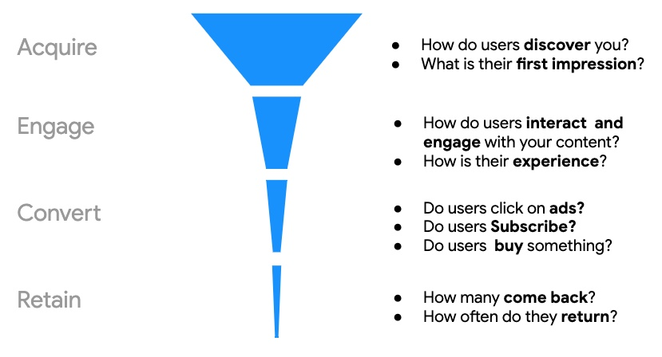
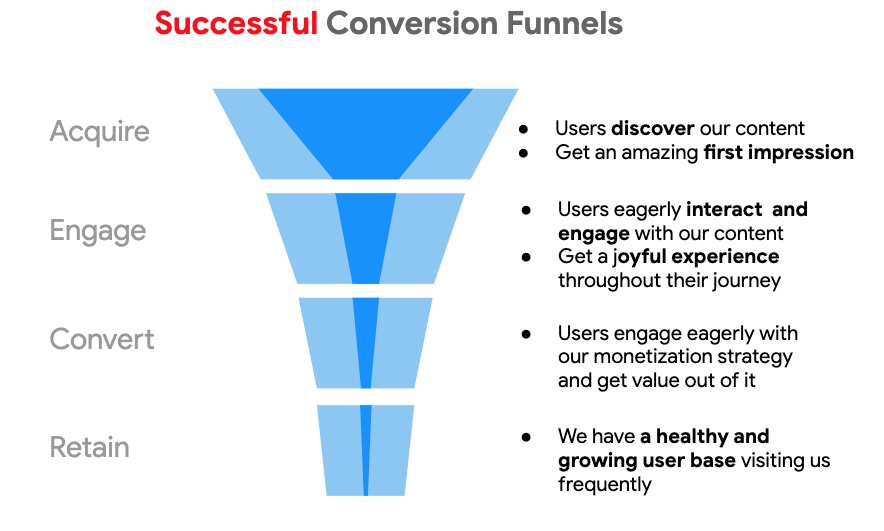
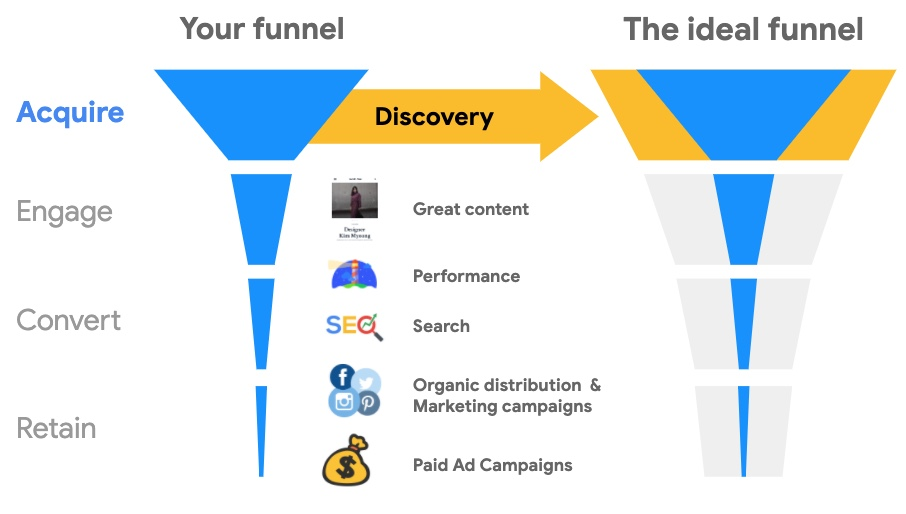
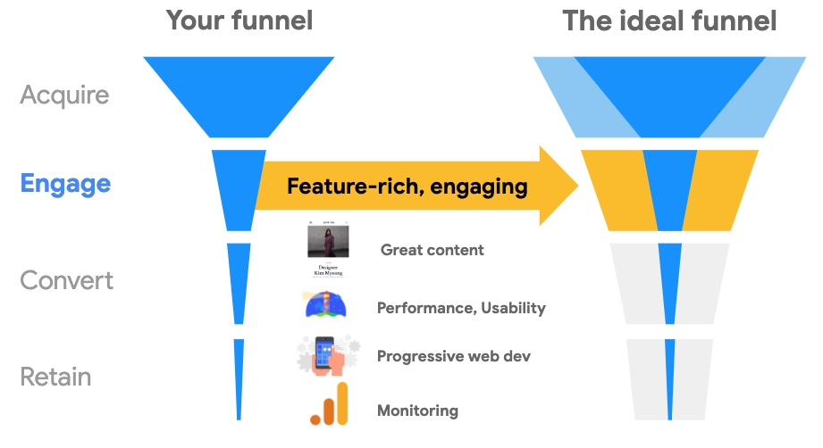
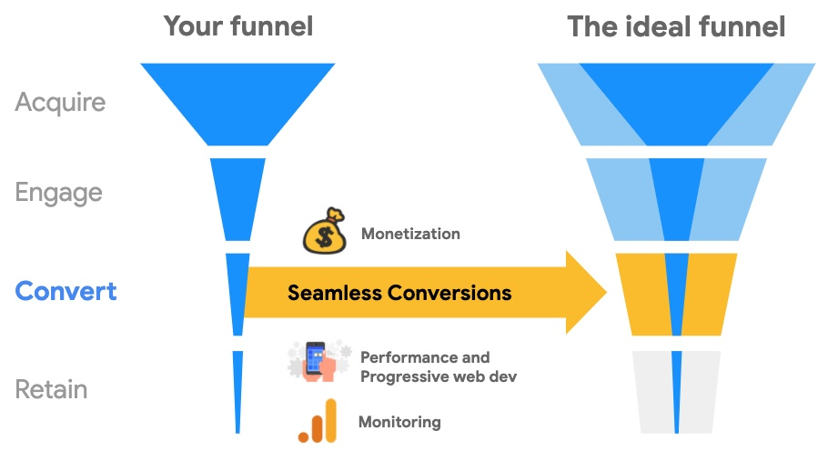
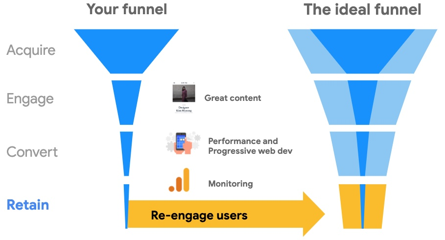
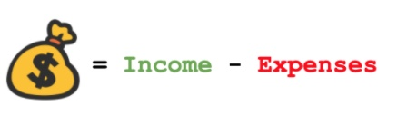
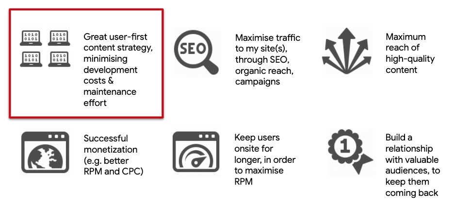

The WordPress project defines its mission as "democratizing publishing". Just like in real life, democratizing publishing must go hand-in-hand with the democratization of capabilities to do what is needed to have a fair shot at success. The good news is that the web platform has evolved in amazing ways during the last few years, supporting now a wide range of capabilities to implement successful content strategies.


Success is everyone's responsibility: developers, webmasters, ane decision makers. We all need to understsand the factors influencing the chances of achieving successfule content strategies in the web.


## What will you learn?

Building successful sites is not a trivial matter. There are many aspects involved, and mastering them all may be imposible is we don't have the skills or the resources necessary. It is important that we (everyone) understand all these aspects, and what do we need to achieve on each of them. With that understanding we will be able to assemble sites and deliver content experiences our users love, and we will be able to do that in a cost-effective way. 

## Conversion Funnels

In our context, being successful means achieving a sustainable web content strategy. This kind of success can be described using the concept of a Conversion Funnels: a sales metaphor capturing the journey followed by consumers of a given product, and how the universe of those consumers is reduced as they advance through the different phases of that journey.

<figure class="w-figure">
  
  <figcaption class="w-figcaption">
    Conversion Funnels: a sales metaphor capturing the journey of consumers of a given product
  </figcaption>
</figure>

The phases of a conversion funnel are:

* **Acquisition**:  How do your users discover your content?  What is the first impression they get?
* **Engagement**: How do users interact and engage with your content? How is the experience they get on their journey consuming your content?
* **Conversions**: How do our users contribute with our bottom line? do they click on ads?; are they making buying decisions; are they subscribing?
* **Retention**: the holy grail of successful conversion funnels, as we want users to keep coming back to our site; we want them to remember our site and be able to return to get more of the value we are offering to them

A key fact to remember about conversion funnels is that a **successful Conversion Funnel** is a fat funnel. We want to have as many users as possible going through each of the different stages of the conversion funnel. And to do that, we must ensure that we get things right on every one of the stages, and that we do that in a cost effective way. 

<figure class="w-figure">
  
  <figcaption class="w-figcaption">
    We want to have as many users as possible going through each of the different stages of the conversion funnel.
  </figcaption>
</figure>

## Success Factors
If we look 'under the hood' into what we need to achieve at each stage of the conversion funnel, we can identify a set of underlying factors that are essential to our success. We call these **Success Factors**.

### Acquisition

This stage is all about attracting and capturing the interest of users. And achieving this at a maximum scale encompasses several key factors.

<figure class="w-figure">
  
  <figcaption class="w-figcaption">
    We want tons of users to discover us and get hooked with our content.
  </figcaption>
</figure>

* **Great content**: useful content, interesting headlines, immersive experiences 
* **Good Performance**: this is very important because loading performance and usability are often deal breakers during the phase of acquiring users
* **Good SEO**: so that search engines find and index your content properly
* **Organic distribution and marketing campaigns**: so we amplify the reach of our content
* **Paid ad campaigns**: to expand our reach beyond the scope of our audience

### Engage

Once users have found us, we want them to engage with our content and continue their journey through our site. The following underlying factors play a role on achieving this.

<figure class="w-figure">
  
  <figcaption class="w-figcaption">
    We want users to continue their journeys and engage deeply with our site.
  </figcaption>
</figure>

* It is again important to have **great content** which our users would want to consume
* **Performance and Usability**: is essential to provide a good UX in terms of smooth transitions, good runtime performance, no blocking content, no shifting content in front of users eyes
* The notion of **Progressive Web Development** comes into play since it allows us to implement features that make it easier for our users to engage with our content by leveraging the capabilities of the web platform
* And we need to have **good monitoring strategies**, so that we can understand how our users are interacting with our sites, what parts of our content are working and which are not. For this we need tools such as analytics, search console, and A/B testing

### Conversions

Monetization plays a fundamental role in sustainability, as it represents the revenue component of our performance as a business. Maximizing this part of the equation is influenced by:

* **Engagement time**: The more time users spend on our site, the greater the chance that a conversion will take place.
* **Revenue-generating mechanisms**: offering effective, high-performance, value-offering monetization options increase the chance of our users converting on them

Engagement time is accounted for in the other stages of the conversion funnel. And regarding maximizing revenue, we need to account for the following factors.

<figure class="w-figure">
  
  <figcaption class="w-figcaption">
   We want our users to easily and effectively enagage with our monetization stratyegies.
  </figcaption>
</figure>

And to maximize the chances of this happening, we need the following components:

* **Good monetization strategy**: e.g. e-commerce integration to sell things; e.g. a subscription model; e.g. membership model
* **Good performance** is again a must because if we have ads loading super slow, users will likely not get to see them
* **Progressive Web Development** helps us because if we integrate with modern APIs such as the Web Payments API and the Credentials API, we will make the conversion experience easier for our users 
* **Good monitoring strategies** are very important, because we need to understand how our monetization strategies are working so we can calibrate them appropriately

### Retain
In order to **achieve success in a sustainable way**, we need to have a healthy and growing (at least up to certain point) user base with many users consistently coming to our site. Several key factors influence this stage.

<figure class="w-figure">
  
  <figcaption class="w-figcaption">
   We want our users to easiily and effectively enagage with our monetization stratyegies.
  </figcaption>
</figure>

* Again, **great content** is key; we want to offer value to our users so they have an strong incentive to come back
* We must have **features and capabilities** in our sites that make it easy for users to come back to us; for example (e.g. A2HS, Push notifications)
* And we also need to **monitor** the behavior of our sites and users in the wild, and seek answers to questions such as: Are we seeing higher bounce rates on some parts of our sites?; What kind of content is performing better?; Should we try a different content layout?

## Revenue and Sustainability

In order to nail down all the described  success factors, we must invest financial resources on development, maintenance, advertising, SEO, monetization, performance enhancements, etc. Depending on our organization (individual or business), we may have resources to cover only some of the required success factors. But if we do not account for all of them, then our chances of success will be diminished. Our sustainability as publishers and content creators requires that we optimize the Revenue Equation.

The Revenue Equation is simply the difference between what we receive and net income via our content offering, minus the investment we must do in order to receive such a net income.

<figure class="w-figure">
  
  <figcaption class="w-figcaption">
   In order to succeed sustainably, we must maximize the revenue equation.
  </figcaption>
</figure>

Where:
* **Gross Income**, generated from our monetization strategies we can have in our sites: Ads, subscriptions, donations, or e-commerce
* **Expenses**, encompassing all financial investment for design, development, implementing monetization campaigns and SEO strategies, etc.

## What's next?

Achieving  successful conversion funnels entails tackling many complex problems. 

<figure class="w-figure">
  
  <figcaption class="w-figcaption">
   We must account for many key factors in order to have a fair shot at success.
  </figcaption>
</figure>

As content creators, we should be focusing mainly on defining our content strategy and producing our content. But instead, we have to do that, while also having to deal with all the other aspects needed to have a fair shot at success. 

In the rest of Section, you can explore more about the different stages of the conversion funnel, and get a sense of the technical implications to achieving all of them in a cost-effective way.

[collection]: /wordpress
